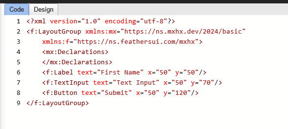
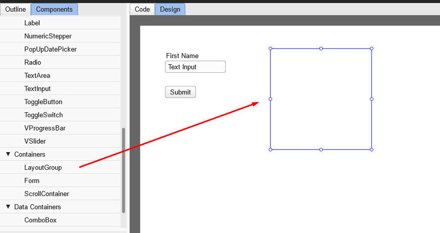
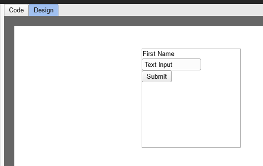
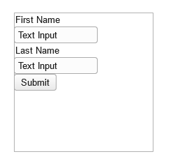
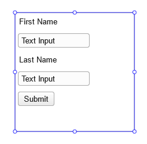

### Diving into MXHX

Welcome back! In [part 1](/docs/moonshine.dev/why_moonshinedev_is_your_new_best_friend_for_building_user_interfaces), we introduced you to [Moonshine.dev](https://www.moonshine.dev/), an innovative platform for building user interfaces with Haxe, Feathers UI, and the declarative XML component markup language, MXHX. We walked you through the steps to create a simple interface using the WYSIWYG editor, adding components like Labels, TextInput, and Buttons. Now, in part 2, we’re going to dive deeper into MXHX and explore its powerful features in the code tab.

#### Benefits of Using MXHX

Before we get started, let's quickly revisit why MXHX is such a game-changer for UI development:

- **Declarative Syntax**:
MXHX uses an XML-based syntax that makes it easy to define UI components, focusing on structure and design without boilerplate code.

- **Consistency**:
By defining components declaratively, you ensure consistency across different projects.

- **Efficiency**:
Simplifies the process of building complex interfaces, enhancing productivity.

#### Exploring the Code Tab

Now that we have a basic understanding of MXHX, let’s switch to the Code tab in Moonshine.dev. Here, you can see the underlying MXHX code generated by the WYSIWYG editor. This code defines the UI components and their properties, making it easy to understand how the visual elements are structured.



Let's break down the provided MXHX code step by step:

###### XML Declaration

```xml
<?xml version="1.0" encoding="utf-8"?>
```
This line declares the XML version and the character encoding used in the document. Here, it specifies XML version 1.0 and UTF-8 encoding.

###### LayoutGroup Container

```xml
<f:LayoutGroup xmlns:mx="https://ns.mxhx.dev/2024/basic"
    xmlns:f="https://ns.feathersui.com/mxhx">
```
- `<f:LayoutGroup>`: This is the root container for our UI elements. It groups multiple components and manages their layout.
- `xmlns:mx`: Defines the XML namespace for MXHX elements.
- `xmlns:f`: Defines the XML namespace for Feathers UI elements.

###### Declarations Section

```xml
<mx:Declarations>
</mx:Declarations>
```
The `<mx:Declarations>` section is used to declare reusable components, styles, or other configurations. In this example, it is empty but typically, you would place shared resources here.

###### Label component

```xml
<f:Label text="First Name" x="50" y="50"/>
```
- `<f:Label>`: Defines a label UI component from Feathers UI.
- `text`: Sets the display text of the label to "First Name".
- `x` and `y`: Position the label at 50 pixels from the left and 50 pixels from the top of the LayoutGroup container.

###### TextInput Component

```xml
<f:TextInput text="Text Input" x="50" y="70"/>
```
- `<f:TextInput>`: Defines a text input field from Feathers UI.
- `text`: Sets the default text within the input field to "Text Input".
- `x` and `y`: Position the text input at 50 pixels from the left and 70 pixels from the top of the LayoutGroup container.

###### Button Component

```xml
<f:Button text="Submit" x="50" y="120"/>
```
- `<f:Button>`: Defines a button UI component from Feathers UI.
- `text`: Sets the display text of the button to "Submit".
- `x` and `y`: Position the button at 50 pixels from the left and 120 pixels from the top of the LayoutGroup container.


#### Understanding Layouts in MXHX

Layouts are essential for organizing UI components in a structured and visually appealing manner. MXHX provides several layout options to help developers manage the positioning and sizing of components effectively. Here, we’ll explore three primary layout types: AnchorLayout, HorizontalLayout, and VerticalLayout.

- **AnchorLayout**

The AnchorLayout is the most basic and default layout in MXHX. If you don't specify any other layout, you are using AnchorLayout by default. This layout allows you to anchor UI components to the edges of the container or to other components, providing a high degree of flexibility and control over their positioning. It is particularly useful for precise placement of elements within a container.

- **HorizontalLayout**

The HorizontalLayout arranges components in a horizontal row. This layout is ideal for creating navigation bars, button groups, and other horizontal component arrangements. By using HorizontalLayout, you can ensure that your components are aligned in a neat row, making it easier to manage horizontal spacing and alignment.

- **VerticalLayout**

The VerticalLayout arranges components in a vertical column. This layout is perfect for stacking components such as form fields, lists, and menus vertically. VerticalLayout helps you maintain a clean, organized vertical flow of elements, which is particularly useful for creating forms and lists.

#### Creating a LayoutGroup with VerticalLayout in the Editor

1\. Add a new `LayoutGroup` component to the canvas, next to the existing components.

   

2\. Go to the `Properties`, find the `Layout` section, and set it to `VerticalLayout`.

   

3\. Drag your existing components one by one into the `LayoutGroup` component. The result should look like this:

   

4\. Try dragging more controls and using your knowledge of setting properties to achieve this result:

   

5\. With your `LayoutGroup` selected, go to the `Properties`, `Layout` section, and set the `Gap` property to 10. Set all `Padding Left`, `Padding Right`, `Padding Top`, and `Padding Bottom` to 5. The result should look like this:

   

6\. Go back to the Code tab and take a look:

```xml
<?xml version="1.0" encoding="utf-8"?>
<f:LayoutGroup xmlns:mx="https://ns.mxhx.dev/2024/basic"
    xmlns:f="https://ns.feathersui.com/mxhx">
    <mx:Declarations>
    </mx:Declarations>
    <f:LayoutGroup width="200.0" height="200.0" x="258" y="46">
		
		<f:Label text="First Name"/>
		<f:TextInput text="Text Input"/>
		<f:Label text="Last Name"/>
		<f:TextInput text="Text Input"/>
		<f:Button text="Submit"/>
		<f:layout>
			<f:VerticalLayout gap="10" paddingLeft="5" paddingRight="5" paddingTop="5" paddingBottom="5"/>
		</f:layout>
	</f:LayoutGroup>
</f:LayoutGroup>
```

7\. Notice a few interesting things:
- Line 6 defines your LayoutGroup.
- Lines 13-15 define the VerticalLayout for the LayoutGroup.
- Line 14 sets the paddings and gap.
- Previously, the Label, TextInput, and Button components had x and y properties. Now they do not because they are not inside an AnchorLayout anymore.
- The LayoutGroup on line 6 has x and y properties because it is nested inside the LayoutGroup on line 2, which does not define any layout for itself. This means it uses the default AnchorLayout, requiring its immediate children to have x and y properties.

#### Conclusion

In this part of our series, we delved deeper into the functionalities of MXHX within the [Moonshine.dev](https://www.moonshine.dev/) platform. We explored the Code tab to understand how the XML code defines UI components and their properties. We introduced the `LayoutGroup` and discussed three primary layout types in MXHX: `AnchorLayout`, `HorizontalLayout`, and `VerticalLayout`.

We also provided a step-by-step guide on how to create a `LayoutGroup` with `VerticalLayout` in the Moonshine.dev editor, emphasizing setting properties like gap and padding to achieve a clean, organized interface. This part has equipped you with the knowledge to start utilizing advanced layout features in MXHX, making your UI development more structured and efficient.

Stay tuned for the next part of our series, where we will explore more advanced features and best practices for creating exceptional user experiences with Moonshine.dev.

For more detailed documentation and examples, visit:

- [mxhx.dev](https://mxhx.dev/)
- [feathersui.com](https://feathersui.com/)
