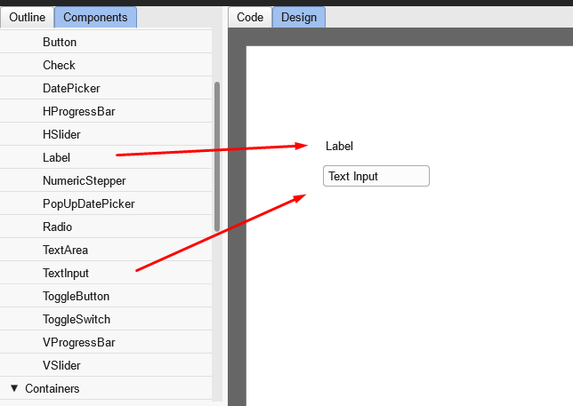

### Introduction to MXHX: Enhancing Feathers UI with the Power of Declarative UI

In the dynamic world of front-end development, the quest for efficient, reusable, and scalable user interfaces is never-ending. Haxe, with its robust cross-platform capabilities, and Feathers UI, with its extensive UI component library, offer powerful tools for developers. Enter MXHX, a declarative XML component markup language that takes the integration of these tools to the next level. By leveraging MXHX, developers can streamline their workflow and enhance the functionality of their Feathers UI projects.

#### What is MXHX?

MXHX is a markup language designed specifically for defining and managing UI components within the Haxe ecosystem. It provides an XML-based syntax for describing user interfaces, simplifying the process of building complex UIs by focusing on structure and design rather than boilerplate code.

#### The Role of Feathers UI

Feathers UI is a powerful framework that provides a wide array of cross-platform UI components. It is built on Haxe and OpenFL, making it a versatile choice for developers aiming to create rich, interactive user interfaces. Feathers UI's components include buttons, sliders, toggles, scrolling lists, and layout containers, all of which are optimized for performance across various platforms.

While Feathers UI can be used independently to build sophisticated UIs, integrating MXHX allows developers to define these components declaratively. This integration not only enhances the development experience but also ensures that UI components are consistent and reusable across different projects.

#### Benefits of Using MXHX with Feathers UI

- **Declarative Syntax**:
  MXHX’s XML-based syntax offers a clear and concise way to define UI components, making it easier to manage and maintain complex interfaces. This aligns perfectly with the component-based architecture of Feathers UI, promoting a clear separation of concerns.

- **Enhanced Cross-Platform Capabilities**:
  By compiling Haxe code into multiple target languages, developers can ensure that their MXHX-defined UIs function seamlessly across web, mobile, and desktop platforms. Feathers UI’s support for various platforms further enhances this capability.

- **Rich Component Library**:
  Feathers UI provides a comprehensive library of UI components, which can be easily integrated and customized using MXHX. This allows developers to leverage Feathers UI’s rich feature set while maintaining clean and maintainable code.

- **Efficiency and Performance**:
  The combination of Haxe’s optimizing compiler and Feathers UI’s GPU-accelerated rendering ensures that applications built with MXHX are both efficient and performant across different devices.

#### Benefits of using [Moonshine.dev](https://www.moonshine.dev/)

Using Moonshine.dev with MXHX offers significant benefits, particularly with its WYSIWYG editor and the upcoming AI form generation tool. The WYSIWYG editor allows developers to visually design and customize their user interfaces in real-time, streamlining the development process and reducing the need for extensive coding. This intuitive editor enhances productivity by allowing immediate feedback and adjustments. Additionally, the soon-to-be-released AI form generation tool will further simplify the creation of complex forms by automatically generating form structures based on user input and requirements. These features make Moonshine.dev an invaluable platform for developers looking to efficiently build, test, and deploy sophisticated UIs with MXHX and Feathers UI.

#### Getting Started

Getting started with MXHX and Feathers UI is straightforward. Follow these steps to create your first interface:

1\. To begin using MXHX with Feathers UI, start by navigating to [Moonshine.dev](https://www.moonshine.dev/) and clicking on the 'TRY NOW' button on the WYSIWYG Editor card.

2\. Click the 'New Canvas' button to create a new workspace. In the WYSIWYG Editor, you'll see a side panel on the left with the Components tab open and the main area in the center with the Designer tab selected.

3\. Select the Label component from the side panel and place it on the designer canvas. Next, add the TextInput component below the Label. It should look like this:



4\. Switch to the Code tab to view the underlying code, which should look something like this:

```mxhx
<?xml version="1.0" encoding="utf-8"?>
<f:LayoutGroup xmlns:mx="https://ns.mxhx.dev/2024/basic"
	xmlns:f="https://ns.feathersui.com/mxhx">
	<mx:Declarations>
	</mx:Declarations>
	<f:Label text="Label" x="143" y="122"/>
	<f:TextInput text="Text Input" x="137" y="160"/>
</f:LayoutGroup>
```

5\. Let's analyze this code. The first line is the XML declaration.

6\. The next part defines a Feathers UI `LayoutGroup`. `LayoutGroup` is a container component used to organize and manage the layout of its child components. It acts as a flexible container that can hold various UI elements, such as labels, buttons, text inputs, and other components, arranging them according to specified layout rules. The `LayoutGroup` provides a structured way to build and manage complex user interfaces by organizing components within a defined layout system, ensuring that the UI elements are properly aligned and positioned.

7\. The default layout for a LayoutGroup in MXHX is the Anchor Layout. This layout positions its child components based on their `x` and `y` coordinates, allowing for precise placement within the container. The LayoutGroup can also support other types of layouts, such as Horizontal and Vertical layouts, which arrange the components in a row or column, respectively.

8\. The `<mx:Declarations>` tag is included but not used in this example. It’s for global definitions if needed later.

9\. The Label and TextInput components are defined with their text and positions.

10\. In MXHX, the Label component is a simple text element used to display static text within a user interface. The primary function of a Label component is to display a string of text. This can be used for titles, descriptions, or any other text in the UI.

11\. The TextInput component is an interactive element used for capturing user input, such as text fields in forms. The primary purpose of the TextInput component is to allow users to enter and edit text. It is commonly used in forms for fields like names, email addresses, passwords, and search queries.

12\. Child components are positioned using absolute coordinates (x and y), which specify their exact location within the container. To make the Label and TextInput components look nice, we need to position them properly within the LayoutGroup. Here’s an example with adjusted x and y coordinates:

```mxhx
<f:Label text="Name" x="20" y="20"/>
<f:TextInput text="Text Input" x="20" y="50"/>
```

#### Conclusion

MXHX provides a powerful, declarative approach to defining user interfaces in Haxe, perfectly complementing the extensive capabilities of Feathers UI. By leveraging Moonshine.dev, developers can further streamline their workflow with tools like the WYSIWYG editor and upcoming AI form generation tool. This integration enables developers to create sophisticated, high-performance applications efficiently. Wrapping up this simple example, it's clear how Moonshine.dev enhances the development process. Stay tuned for a series of upcoming blog posts on Moonshine.dev, where we'll dive deeper into form-making and other advanced features to help you deliver exceptional user experiences across web, mobile, and desktop platforms.

For more detailed documentation and examples visit:

- [mxhx.dev](https://mxhx.dev/)
- [feathersui.com](https://feathersui.com/)
