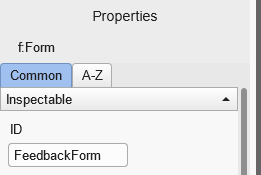
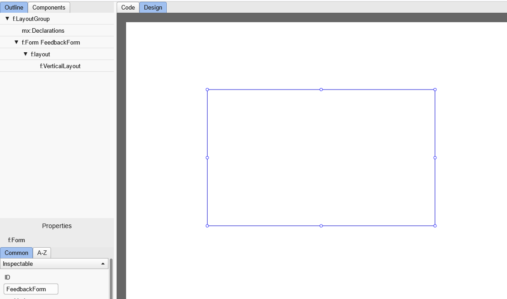
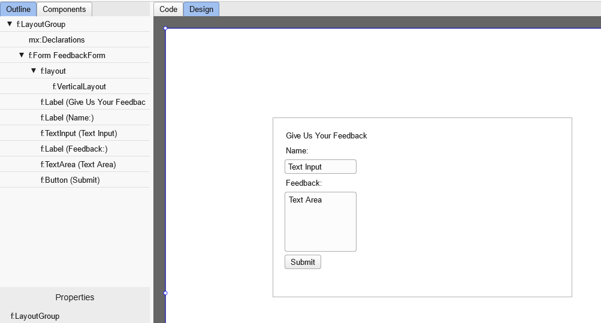
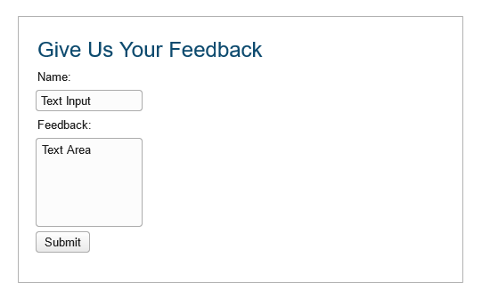
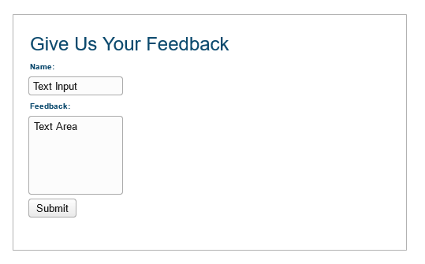
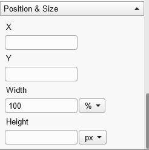
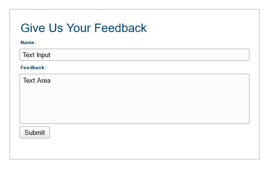
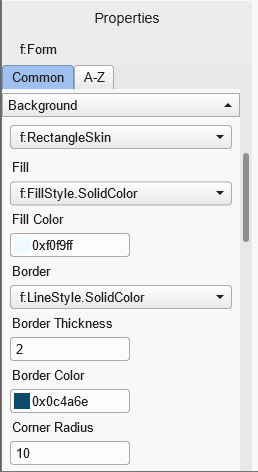
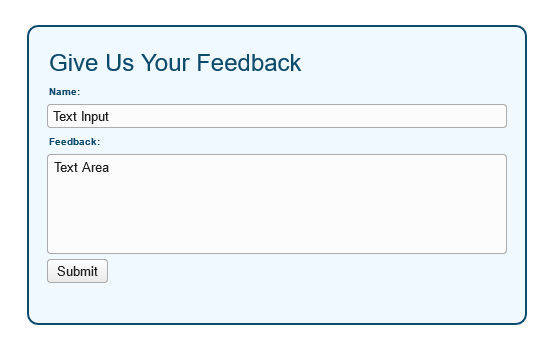
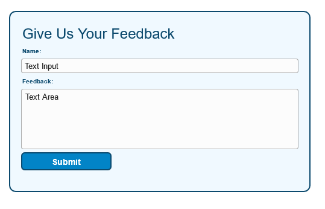

### Styling MXHX Forms

Intro

#### Creating Feedback Form

- Staying in the Design Tab, drag a Form Container to the Canvas
- In the Common properties tab, give it an ID of "FeedbackForm" (will make it easier to find it)

- Give it a width of 500px and height of 300px
- Applay a VerticalLayout to it
- Give it a Gap of 5px and set all paddings to 20px

The result should look like this:

- Take a look at the outline tab. There should be a from with ID of a "FeedbackForm". It's helpful if you want to select it and other elements are obscuring it.

#### Put the Form Elements in Place

- Drag a Label component into Feedback Form and give it a text of "Give Us Your Feedback".
- Drag another Label componet and give it a text of "Name:".
- Drag a TextInput component
- Drag another Label and give it a text of "Feedback:".
- Drag a TextArea component
- Drag a button and give it a text of "Submit".

The result should look like this:

#### Styling Header

- Select the Give Us Your Feedback header, either by clicking on its element in Design tab, or on its name in Outline tab.
- In the Properties panel, Common properties tab go to the Text Styles section.
- Give it a font of \_sans.
- Give it a size of 24
- Give it a color of 0x0c4a6e

The result should look like this:

#### Styling Labels

- Select the Name label
- Give it a font \_sans
- Give it a size of 10
- Give it a color of 0x0c4a6e
- Set the style to Bold

Do the exact same thing with Feedback label.

The result should look like this:

#### Styling the fields

We can also style the text fields to take up the whole width of our form. To do this:

- Select the name TextInput
- In the properties go to Position & Size section
- Set the Width to 100 and units to %

Do the same with Feedback Text Area.

The result should look like this:

#### Styling Form

- Select the FeedbackForm containter. If you have trouble doing it in Designer tab, you can also do it in the Outline tab. You should be able to identify it by ID we gave it earlier.
- Go to the Properties and go to the Background section
- Select SkinType: RectangeSkin. New properties should appear.
- Select FillStyle to SolidColor, then give it a color of 0xf0f9ff
- Select Border LineStyle to SolidColor, then give it a thickness of 2, color of 0x0c4a6e and corner radius of 10

The result should look like this:

#### Styling Button

For this we're going to combine Text Styles and Background.

For text:

- Set font to \_sans
- Set size to 14
- Set color to 0xffffff
- Set bold

For background, we're going to style only the default style for now. It is possible to apply different styles for states of Up, Hover, Down and Disabled.

- Set state to default
- Set rectangle skin
- Set fill to solid color of 0x0284c7
- Set border to solid color
- Set border thicknes to 2
- Set border color to 0x0c4a6e
- Set corner radius to 5

Also set button width to 150px and height to 30px.

The result should look like this:

#### Conclusion

There you go
