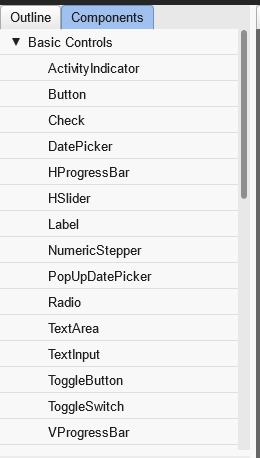
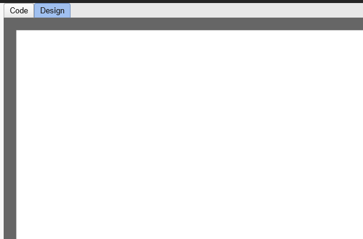
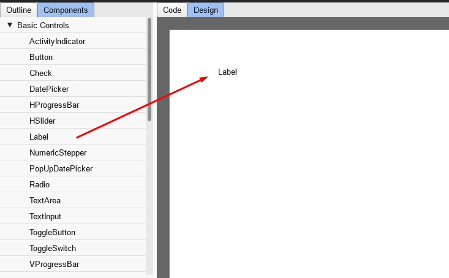
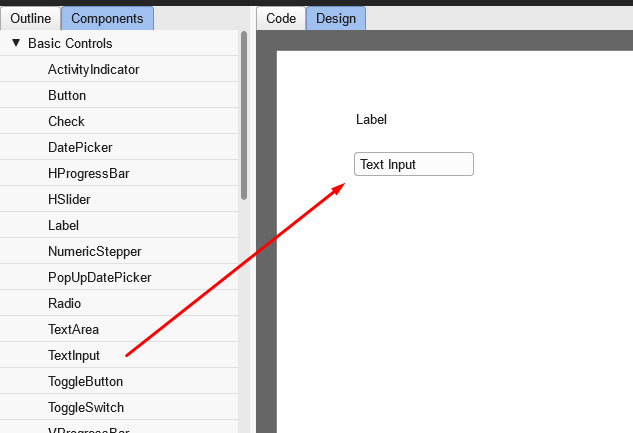
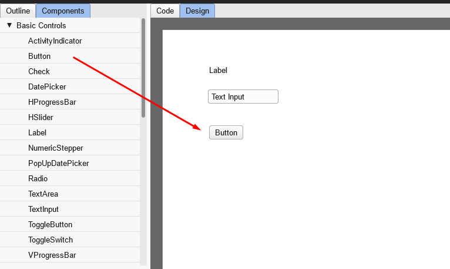
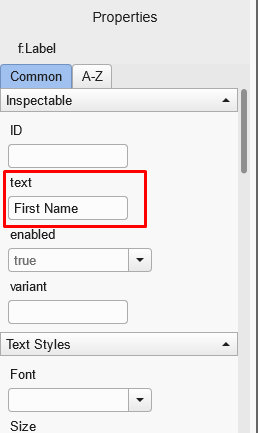
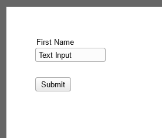

### Why Moonshine.dev is Your New Best Friend for Building User Interfaces

In the fast-paced world of app development, having tools that make your work easier, faster, and more reliable is crucial. Imagine a platform that combines powerful coding capabilities, a versatile set of user interface components, and an easy-to-use design language. That's where [Moonshine.dev](https://www.moonshine.dev/) comes in. This innovative platform simplifies the process of creating complex user interfaces for web, desktop, and mobile applications. By using Moonshine.dev, developers can take full advantage of advanced technologies without getting bogged down in complicated details, making their work smoother and more efficient.

#### The Power of Haxe

Haxe is a robust, cross-platform toolkit that enables developers to write high-performance code that can be compiled into multiple target languages. This flexibility makes Haxe an excellent choice for creating applications that need to run seamlessly across different environments, from web and mobile to desktop platforms. With its strong typing and modern language features, Haxe ensures that developers can write clean, maintainable, and scalable code.

#### OpenFL and Feathers UI

OpenFL is a powerful framework that mirrors the Flash API, enabling developers to create engaging, cross-platform applications with ease. When paired with Feathers UI, it offers dozens of UI controls that can be mixed and matched, including buttons, sliders, toggles, scrolling lists, layout containers, and navigators. This combination ensures the creation of rich, interactive user interfaces optimized for performance across mobile devices, desktop computers, and web browsers. Feathers UI also supports a flexible styling system that caters to designer requirements with bitmap and vector graphics, filters, blend modes, and more, allowing developers to build stunning, GPU-accelerated UIs that are both functional and visually appealing.

#### Introducing MXHX

MXHX is a declarative XML component markup language designed specifically for the Haxe ecosystem. It simplifies the process of building complex user interfaces by allowing developers to focus on structure and design rather than boilerplate code. By using an XML-based syntax, MXHX provides a clear and concise way to define UI components, promoting a consistent and reusable approach to UI development.

#### The Role of Moonshine.dev

Moonshine.dev stands out as a premier platform for developers working with Haxe and Feathers UI. One of its most significant advantages is the WYSIWYG (What You See Is What You Get) editor, which enables developers to visually design and customize their user interfaces in real-time. This feature not only streamlines the development process but also reduces the need for extensive coding, allowing for immediate feedback and adjustments.

Moreover, Moonshine.dev is set to release an AI form generation tool, which will further simplify the creation of complex forms. This tool will automatically generate form structures based on user input and requirements, making it even easier to build, test, and deploy sophisticated UIs. By integrating MXHX with Moonshine.dev, developers can take full advantage of Feathers UI’s rich component library while maintaining clean, maintainable code.

#### Getting Started with Moonshine.dev Editor

Follow these steps to create your first interface:

1\. To begin using MXHX with Feathers UI, navigate to [Moonshine.dev](https://www.moonshine.dev/) and click on the 'TRY NOW' button on the WYSIWYG Editor card.

2\. Click the 'New Canvas' button to create a new workspace.

3\. In the WYSIWYG Editor, you will see a side panel on the left with the Components tab open.

   

4\. The main area in the center will have the Designer tab selected.

   

5\. Select the Label component from the side panel and place it on the designer canvas. Next, add the TextInput component below the Label. It should look like this:

   

6\. Do the same with the TextInput component:

   

7\. And the Button component:

   

8\. Now, let's set the properties of the components. Select the Label component you placed on the canvas in the previous step. On the left, under the Components panel, you should see the Properties panel with the Common tab selected. Find the `text` property and set its value to 'First Name', like this:

   

   You should see the canvas update immediately.

9\. Scroll down the Properties tab to the `Position & Size` section:
- Set X to 50
- Set Y to 50

10\. Now, select the other components and set the following properties:
- **TextInput:**
    - X: 50
    - Y: 70
- **Button:**
    - text: Submit
    - X: 50
    - Y: 120

The result should look like this:

#### Conclusion

In summary, Moonshine.dev, combined with the power of Haxe and the flexibility of MXHX, offers a comprehensive solution for building efficient, reusable, and scalable user interfaces. Whether you're developing for web, mobile, or desktop, Moonshine.dev is the platform that can elevate your development experience to the next level.

Stay tuned for a series of upcoming blog posts on Moonshine.dev, where we'll dive deeper into form-making and other advanced features to help you deliver exceptional user experiences across web, mobile, and desktop platforms.

For more detailed documentation and examples visit:

- [mxhx.dev](https://mxhx.dev/)
- [feathersui.com](https://feathersui.com/)