## Build Moonshine in Moonshine

###### Step 1

#### Install and open Moonshine IDE

Go to https://moonshine-ide.com and download the latest development version of Moonshine IDE. You can also use [this](https://static.moonshine-ide.com/downloads/releases/dev/windows/MoonshineDevelopment-installer.exe) link for direct download.

Open Moonshine IDE. It's going to show Getting Started page. Click on the Download Third-Party Software button.

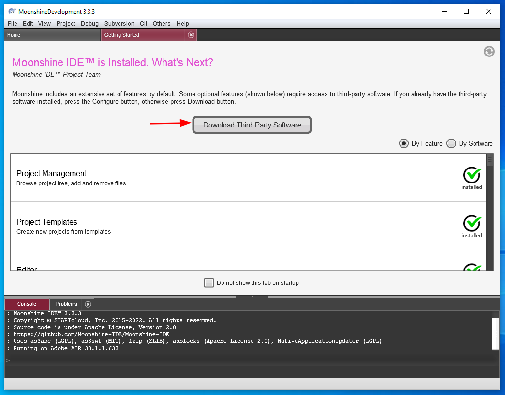

On a Widnos system it's going to download Moonshine SDK Installer directly. On a macOS it's going to take you to a page where you can downlad latest version of Moonshine SDK Installer manually.

Proceed with the install.

###### Step 2

#### Install SDKs.

Moonshine SDK Installer should open automatically.

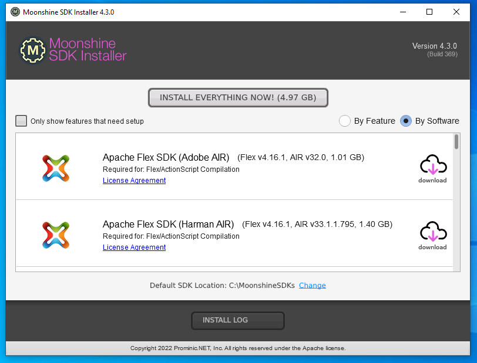

You can download and install all supported SDKs using the Downaload Everything Now button. Alternatively, you can pick and choose your SDKs using their respective download buttons.

For building Moonshine IDE you'll need: Harman Air, Java 11, Ant and Git

###### Step 3

#### Clone repositories.

Open git menu from the App Bar and click Manage Repositories.

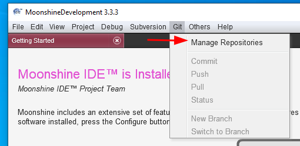

Select Moonshine IDE repository and click Clone.

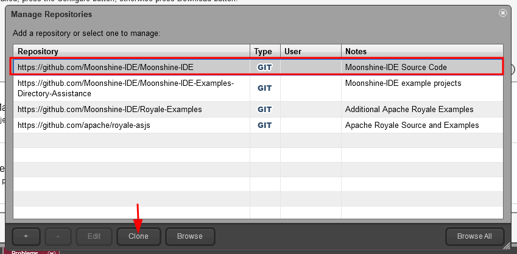

Provide a path and confirm the clonning.

Select MoonshineDESKTOPevolved project and click Open

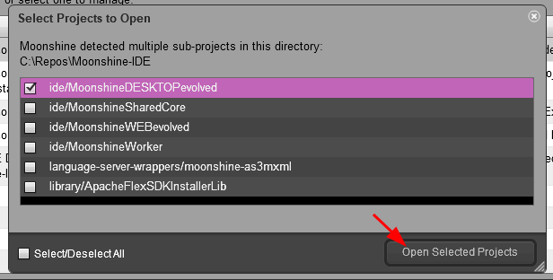

Now we need to clone more repositories that are not on the list.

- https://github.com/Moonshine-IDE/VisualEditorConverterLib
- https://github.com/Moonshine-IDE/MockupVisualEditor
- https://github.com/Moonshine-IDE/Moonshine-SDK-Installer

Click the plus button, provide the link and click Save.

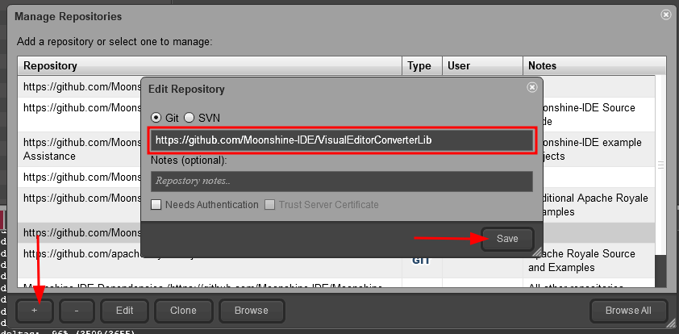

When all the repository links are svaed clone them to the disk.

You should open three projects in Moonshine:

- MoonshineDESKTOPevolved from Moonshine-IDE
- VisualEditorConverterLib
- MockupVisualEditor

You don't have to open any projects from the Moonshine-SDK-Installer.

Your repository structure on disk shoul look like this:

```
Repos
|- Moonshine-IDE
|- Moonshine-SDK-Installer
|- VisualEditorConverterLib
|- MockupVisualEditor
```

###### Step 4

#### Build VisualEditorConverterLib

Your Project View should now tell that your workspace contains three projects:

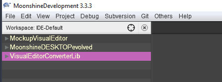

Make sure VisualEditorConverterLib is selected, go to Project menu and click Build with Apache Ant.

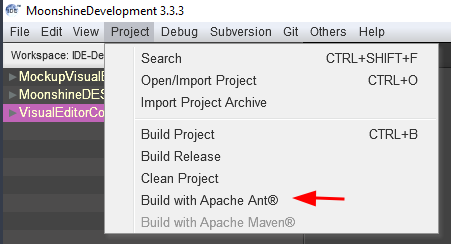

Make sure the build is successfull in the Console output.
Please note, that the build artifact is exported **to the other repository**.

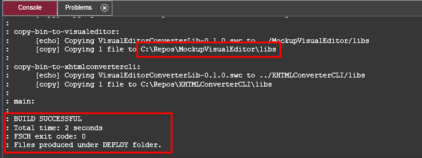

###### Step 5

#### Build MockupVisualEditor

Now that VisualEditorConverterLib.swc is copied into MockupVisualEditor/lib/ folder you can build MockupVisualEditor.

First, in Project View go to the MockupVisualEditor/build.xml file and uncomment line 7:

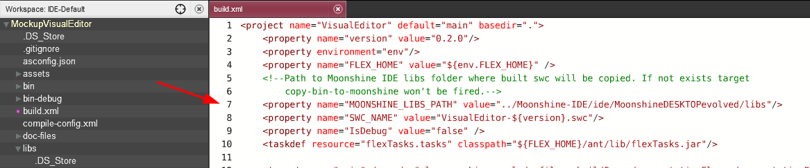

This is neccessary for copying the artifact to Moonshine IDE.

Make sure MockupVisualEditor is selected in the Project View.

Click on the Project menu and select Build with Apache Ant.

Make sure the build is successful.

###### Step 6

#### Build Moonshine IDE with Moonshine

Go to `MoonshineDESKTOPevolved\src\MoonshineDESKTOP-app.xml` and comment out line 350:

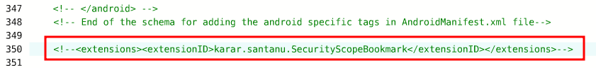

This disables SecurityScopeBookmark extension (which you probably don't have) and let's you run and debug the appilcation without issues.

Everything is redy now to build Moonshine-IDE itself. Make sure MoonshineDESKTOPevolved is selected in the Project View, go to Project menu and click on Buil Project (this time no Ant)

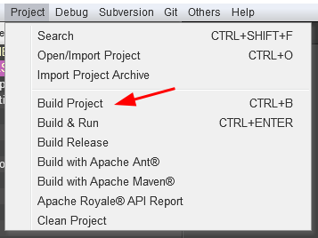

###### Step 7

#### Debug

Set a breakpoint anywhere in the code. A good example is line 187 in `MoonshineDESKTOPevolved\src\MoonshineDESKTOP.mxml` invoked right after start and just before Moonshine IDE performs an automatic update check:

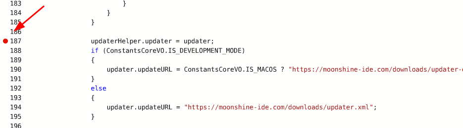

From the Debug menu select Build & Debug

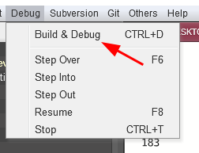

After another build finishes you should see Harman Air splash screen, then Moonshine IDE will launch and pause stepping into the breakpoint.
