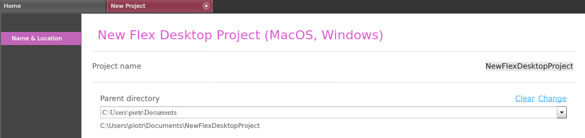
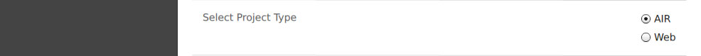
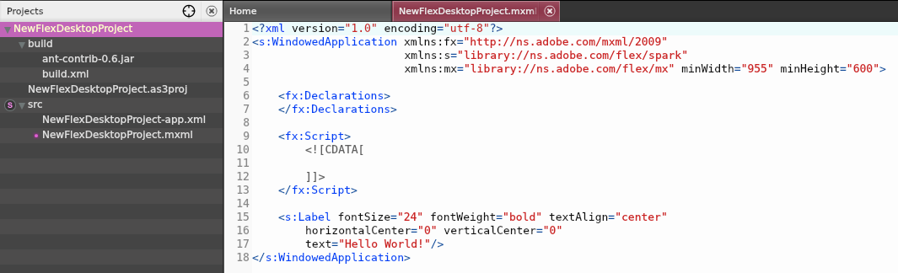
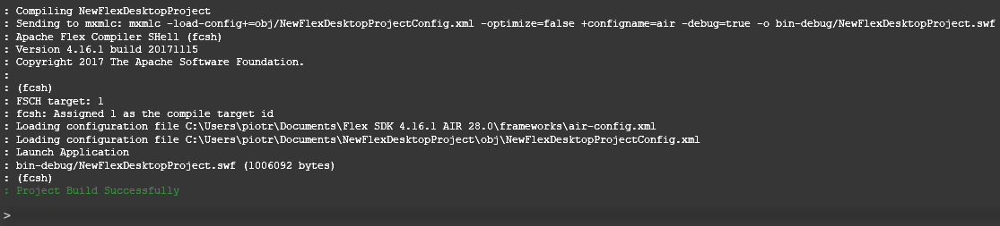

## Create and Build Desktop Projects

1. To create a new desktop based Apache Flex® project do one the following:

   * In Moonshine choose `File -> New -> Flex Desktop Project (MacOS, Windows)` : MXML and ActionScript support
   * In Moonshine choose `File -> New -> ActionScript Project (SWF, Desktop)` : Choose this if you want pure ActionScript project
   * In Moonshine choose `File -> New -> Feathers Desktop Project (MacOS, Windows)` : MXML and ActionScript support
   * Choose _ActionScript Project (SWF, Desktop)_ in Moonshine splash screen
   * Choose _Flex Desktop Project (MacOS, Windows)_ in Moonshine splash screen
   * Choose _Feathers Desktop Project (MacOS, Windows)_ in Moonshine splash screen

2. Choosing any above option will open the New Project tab:

    

3. In _ActionScript Project (SWF, Desktop)_ options you’ll find an extra option to choose between Desktop or Web as the platform type:

    

   * Editable fields are:
     * Project Name
     * Parent Directory
     * Select Project Type (ActionScript Project only)

   * After entering the necessary fields above, click _Create_ to generate a new project

   * Create option immediately creates a new **Apache Flex®** project, open the project in Moonshine workspace (left-hand tree menu) and it’s application file in Moonshine editor

        

   * Moonshine generates any project with it’s supported types with demo ‘Hello World!‘ text, so you can immediately build the project and check it’s output; an optional **Apache Ant®** build script fully configured so you build a desktop package immediately as well!

   * To run the project choose `Project -> Build & Run` or press `CTRL`+`ENTER` (WIN) or `CMD`+`ENTER` (Mac OS). You can see command line output in Moonshine’s console window (at the bottom of the interface)

        

   * If your project compiles, an AIR window will open running your code.
