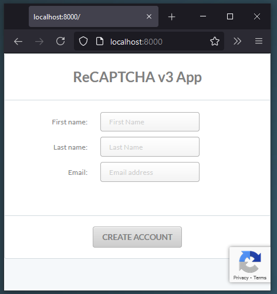
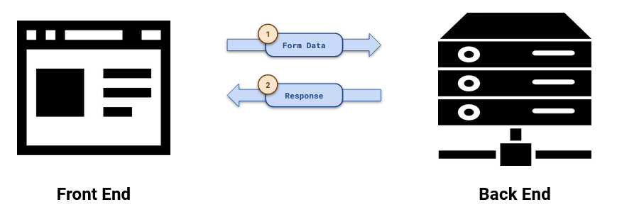
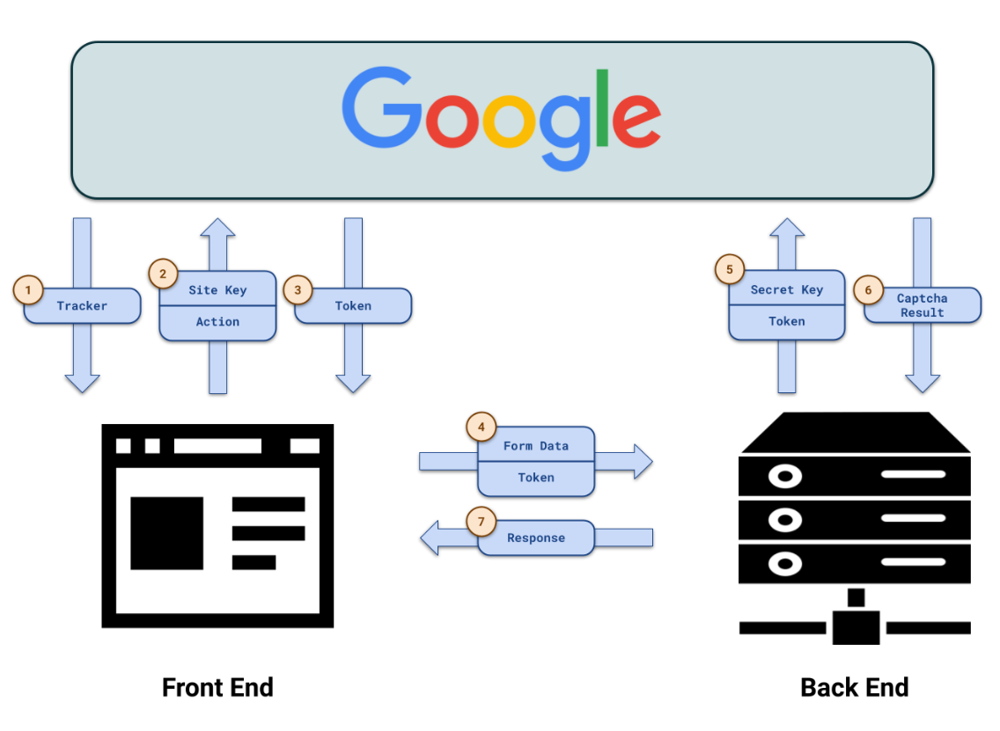
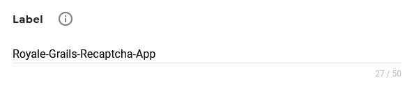
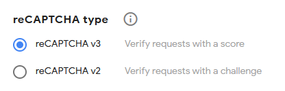
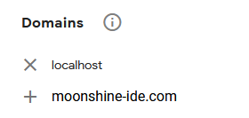
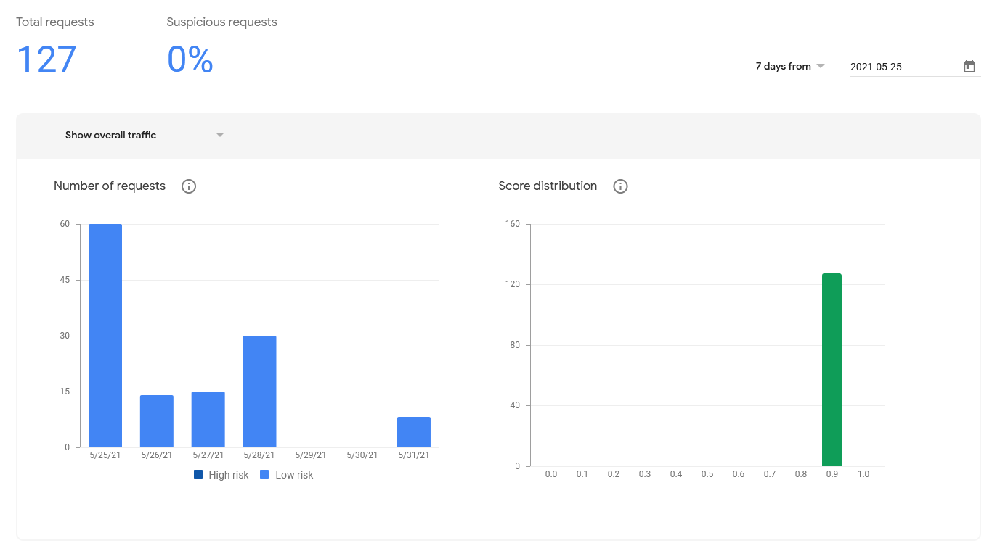

# Part 2

## Communication Overview and reCAPTCHA Registration

---

### User Interface

Let's design a very simple use case for our reCAPTCHA app. It's going to be about creating new user accounts.

### Communication without reCAPTCHA

First, let's consider how the communication between the front end and the back end can look without reCAPTCHA.

The user is asked to type First Name, Last Name, and Email address. After he or she clicks the `Create Account` button the form data will be sent to the back end. The server can perform some validation logic like checking if the email address is unique. Then, it is going to send its `Response` back to the front end.

This is simple and easy but adding reCAPTCHA to the mix results in adding a few additional steps.

### Communication with reCAPTCHA

As you can see this is a bit more complex. But why is it?

Well, this is because, when you think of it, **the data can be gathered only at the front end** but frankly **it can be validated only at the back end**. If we tried to validate the request at the front end where it originated, bots could easily fake our validation result and make a pre-validated request to the back end. That's why we need this ping-pong.

Let's walk through the steps one by one:

1. When the page is loaded we need to download google tracker. It's going to track user behaviors and send them to Google in the background. Based on these behaviors Google can score our users.
2. When the user fills in the data and clicks the Create Account button we need to make a request to Google. We need to send our Site Key (obtained during captcha registration) and an Action (like 'CreateAccount').
3. In response, Google is going to send us a Token. It will be generated based on our Site Key, Action, and recently tracked user behavior.
4. Now we can finally pass the form data to our Back End. We also need to provide the Token obtained from Google.
5. When the Back End receives our request it first needs to validate the Token. It makes a request to Google, providing its Secret Key (also obtained during registration and paired with the Site Key) and the Token itself.
6. In response Google sends Captcha Result. The result contains a couple of interesting information but the most important one is the score Google assigned to the investigated action.
7. Based on the score our Back End is going to make its own decision whether to accept or discard the account creation request. Whatever it decides it can now send the Response to the Front End.

### Register for Google reCAPTCHA

Before we can start implementing anything we need to register at Google for reCAPTCHA. When we do this, Google is going to assign us a pair of Site Key and Secret Key. The former is going to be included on our front end (and therefore will be potentially visible to anyone). The latter is going to sit on our back end, and as the name suggests, we need to keep it secret for it to work.

##### Step 1

Got to the: [https://www.google.com/recaptcha/admin/create](https://www.google.com/recaptcha/admin/create){:target="_blank"}

##### Step 2

Provide a name for your app:

##### Step 3

Then choose reCAPTCHA v3. Only version 3 is going to give you a fully "invisible captcha" -- no interaction with the user at any point.

##### Step 4

Provide the domains you want to use with your reCAPTCHA. If this is going to be a production app you can specify your real domain here. But remember -- if you want to test this app locally you **must** also provide `localhost` as one of your domains.

##### Step 5

Accept the Terms of Service and click Submit.

##### Step 6

You will be provided with a Site Key and Secret Key pair. Copy them and save them somewhere safe. You can now click on Go to Analytics.

##### Step 7

This view will be more helpful once you accumulate some traffic on your front end. It can help you decide what number is a good threshold for each of the captcha-protected actions available on your site.

You're now ready to start implementing your front-end logic and your back-end logic.