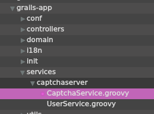
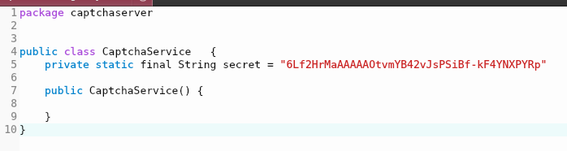
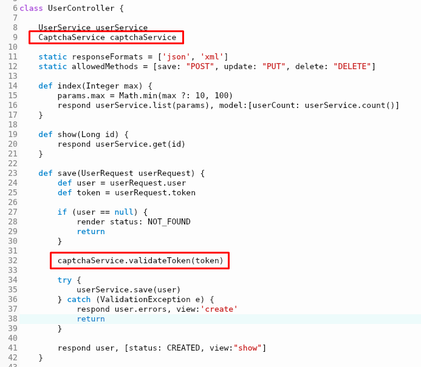
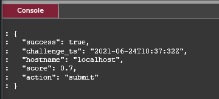
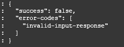
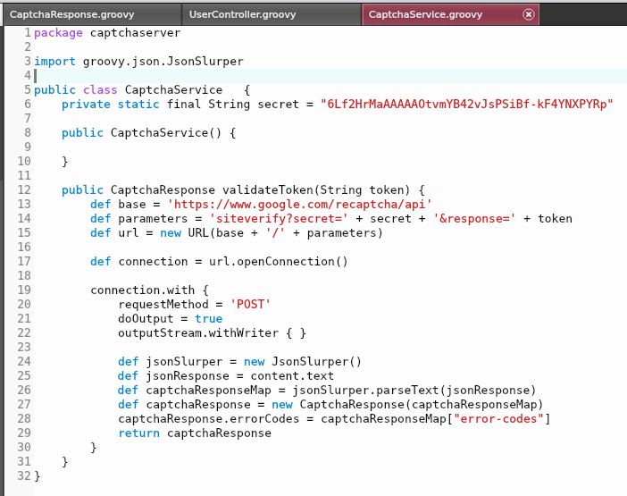
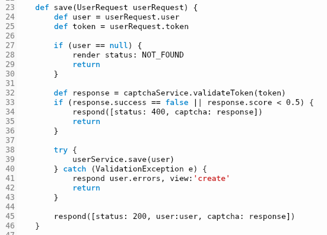

### Google Invisible Captcha - Part 4
---
# Implementing Back-End in Grails

Moonshine IDE is one of the fastest ways to get started with Grails.

#### Installing Grails
First, you need to install Grails in your environment.

###### Step 1
First, you need to download Grails.
Open up Moonshine IDE and go to:
`Help -> Getting Started`


###### Step 2
Click on `Download Third-party Software` 


###### Step 3
Install Grails from the list:


This is going to install Grails to the Moonshine's default SDK folder which is:
- `C:\MoonshineSDKs` on Windows
- ... on Mac

#### Creating REST API App
Our back-end doesn't need any views. It's going to communicate with the front-end via REST API. In Grails, there is a special REST API profile for these kinds of apps. Unfortunately, creating a REST API app from Moonshine is a little tricky. We need to invoke our first command straight from our OS's terminal.

###### Step 4
Open up a terminal (cmd, bash, etc.)

###### Step 5
Go to the location where you want to create the project:


###### Step 6
The command we usually use in Grails would've been: 

`grails create-app --profile rest-api project-name`

But since we don't have grails installed system-wide, we need to use the one downloaded to the SDK folder. Therefore, the actual command is:

`c:\MoonshineSDKs\Grails\grails-3.3.10\bin\grails create-app --profile rest-api captchaserver`

 *You may need to replace `grails-3.3.10` with the current version of Grails downloaded by Moonshine IDE.

###### Step 7
You should have a Grails project that looks like this:


#### Importing and Running the Project
It's time to import and run our newly created project in Moonshine.

###### Step 8
Go to `Project -> Open/Import Project`


###### Step 9
Select the folder you created in the previous step.

###### Step 10
There will be an error telling you to locate the `src` folder. Click `yes`


###### Step 11
Provide necessary project details and click `Create`


###### Step 12
It's time to run our application. Go to `Project -> Build & Run`


and wait until the build is completed. 

###### Step 13
Open up a browser and go to `http://localhost:8080`.
You should see this:


###### Step 14
Grails supports hot reloading. Most of the time if you change anything in code the changes will be immediately reflected in the app. There are times, however, when you will need to stop the server. You can do this at any time by pressing the red button on the status bar:


One of the times, when you need to stop the server is when you want to invoke a grails command from Moonshine. We're going to do this in the next step, so stop the server now.

#### Creating a User Object

Now, that we have a running initial project we can add our business object. It's going to be a class representing a User with fields like First Name, Last Name, and Email. We want to be able to create this object via REST API and be able to save it to a database.

###### Step 15
To create our User object go to: `Project -> Run Grails command`


###### Step 16
Type in `create-domain-class User`


and click `Run`

This is going to invoke the same command as typing in the terminal:
```
grails create-domain-class User
```

###### Step 17
Navigate to the newly created User class `grails-app/domain/captchaserver/User.groovy`:


###### Step 18
We're going to need our User object to contain firstName, lastname, and email fields, all of type String. Add them all to the User class.

Grails also provides a range of useful constraints for domain object fields: 
- `email: true` -- will require from the field to be a well-formed email address (like `name@domain.com`)
- `unique: true` -- will check if the field is unique in the database scope
- `blank: false` -- will reject `null` or empty string

The final result should look like this:
```
class User {
    String firstName
    String lastName
    String email

    static constraints = {
        email (email: true, unique: true)
        firstName (blank: false)
        lastName (blank: false)
    }
}
```

###### Step 19
Now we need to generate a controller for our domain class. Go to: `Project -> Run Grails command` and execute:
```
grails generate-controller captchaserver.User
```
Beware that "grails" is already typed in. Also, keep in mind you need to use a namespace before the name of the class, in our example, it's `captchaserver.User`.


###### Step 20
Navigate to `grails-app/controllers/captchaserver/UserController.groovy` and take a look at the `save` method:


This is the method that receives information from our front-end. It also returns the final response.

###### Step 21
Let's create logic that automatically adds the first user each time our application starts. Go to `grails-app/init/captchaserver/BootStrap.groovy` and update init function from this:
```
def init = { servletContext ->
}
```
to this:
```
def init = { servletContext ->
  def user = new User(
    firstName: "Arnold", 
    lastName: "Schwarzenegger", 
    email: "arnie@terminator.com")
    
  user.save();
}
```

You don't need to worry about destroy logic for now. This is because when you're in development mode the database works in `create-drop` mode by default. This means all users entries we add will be forgotten when we restart the server. This is rather handy during development -- we can add the same user over and over again to see if the controller is working correctly. The user with id #1 is added every time application starts to ensure we always have at least one user to show in a controller.

###### Step 22
Start the server again by going to `Project -> Build & Run`.

In your browser go to `http://localhost:8080/user/`.
You should see this:


#### Testing the REST API
By now we have a working user controller which can display the current list of saved users. But does it accept HTTP POST requests? Let's find out!

We'll use curl, which is a standard part of any shell (cmd, bash, mac terminal). We can also test using our front-end in Royale (or any other technology), but in a lot of cases using curl is simpler.

###### Step 23
Go to any location outside your main project, create a new file and name it `body.json`. Open it using any text editor and add the following content:

```
{
    "firstName" : "Sylvester",
    "lastName" : "Stalone",
    "email" : "sly@rambo.com"
}
```

###### Step 24
Open up a terminal (cmd or bash) and execute the command:

```
curl -X POST -H "Content-Type: application/json" -d @body.json http://localhost:8080/user/
```

This is going to perform an HTTP POST request using the data from the `body.json` file.
You should receive the following response:

```
{"id":2,"firstName":"Sylvester","lastName":"Stalone","email":"sly@rambo.com"}
```

###### Step 25
Go again to your web browser and check `http://localhost:8080/user`. You should see newly created user:


#### Captcha Validation
Right now we have a working MVC-style application -- the view is coded in Royale and Model-Controller is coded in Grails. The data can already flow from the front-end to the back-end via REST API.

It's time to add reCAPTCHA validation logic:
1. First, we will change the `save` method signature to accept both user and token.
1. Then, we will connect to Google and validate that token
1. Then, we will accept or reject the request and return a response to the front-end.

###### Step 26
Right-click on your main project `captchaserver` and go to settings:


###### Step 27
Go to `Paths` tab:


Take a look at existing paths. There's a path for `grails-app/controllers` and `grails-app/services` but Moonshine doesn't know the path to `grails-app/domain`!

Let's change that by clicking on `Click to add`!

###### Step 28
Click on the `Browse dir` button next to `No value`:


###### Step 29
Navigate to your project and select the `captchaserver/grails-app/domain` folder. Your final result should look like this:


Click `Save`.

###### Step 30
Let's create UserRequest object.

Go to `grails-app/domain/captchaserver`, right click on it and select `New -> Groovy Class`:


###### Step 31
Name the class `UserRequest` and click `Create`:


###### Step 32
Modify the class by adding the fields for user and token and initializing them in the constructor:

```
package captchaserver

public class UserRequest   {
    User user
    String token
    
    public UserRequest(User user, String token) {
        this.user = user
        this.token = token
    }
}
```

###### Step 33
Navigate to `grails-app\controllers\UserController.groovy` and find again the `save` method.

###### Step 34
Modify the method to accept UserRequest instead of User. Unpack user and token inside to respective variables:

```
def save(UserRequest userRequest) {
        def user = userRequest.user
        def token = userRequest.token
        
        if (user == null) {
            render status: NOT_FOUND
            return
        }

        ...
    }
```

###### Step 35
You can now modify `body.json` accordingly:

```
{
    "user" : {
        "firstName" : "Sylvester",
        "lastName" : "Stalone",
        "email" : "sly@rambo.com"
    },
    "token" : "abcd"
}
```

and again perform HTTP request:

```
curl -X POST -H "Content-Type: application/json" -d @body.json http://localhost:8080/user/
```

**Tip:** If user #2 already exists, either restart the server or change the email address to be unique.

#### Testing with Royale front-end
Our REST API matches now the data our front-end can send. Before we can start using our front-end for testing we need to enable [CORS](https://en.wikipedia.org/wiki/Cross-origin_resource_sharing){:target="_blank"} in Grails.

###### Step 36
Go to `grails-app/conf/application.yml` and locate `grails` entry:


###### Step 37
We need to add:

```
cors:
    enabled: true
```

somewhere under the following entry:


**Keep in mind YAML files do not allow tabs, so you need to use spaces for indentation.**

###### Step 38
Restart the server. Your CORS settings will not work until you restart.

From now on, you can finally start using your front-end to test instead of curl (if you find it preferable).


#### Validating Captcha
Let's start talking to those Google servers to validate our request!

###### Step 39
Navigate to `grails-app/services/captchaserver`, right-click and select `New -> Groovy Class`. Name the class `CaptchaService`.



###### Step 40
Add a field with your private token. Keep in mind, that when a private token becomes compromised (like this one), it is no longer secure.



###### Step 41
Create validateToken method:

```
public validateToken(String token) {
        def base = 'https://www.google.com/recaptcha/api'
        def parameters = 'siteverify?secret=' + secret + '&response=' + token
        def url = new URL(base + '/' + parameters)
    }
```
As you can see, this method takes a token, and then builds a URL using this token and the hardcoded secret key.

###### Step 42
Now we need to make an HTTP POST request to that URL and capture the response. Add the following code to your method:

```
def connection = url.openConnection()
        
connection.with {
    requestMethod = 'POST'
    doOutput = true             
    outputStream.withWriter { }
    
    println content.text
}
```

This opens the connection using the POST method, signals that it is interested in the output, and uses the writer to put this output into a content variable. Then you can print the text of the content to the console.

###### Step 43
ValidateToken method is almost ready for a test, but first, we need to use it. Go to `grails-app/controllers/captchaserver/UserControler`. Then:
- add `CaptchaService captchaService` to the class members
- add `captchaService.validateToken(token)` call in the `save` method (after checking if the user is null, but before saving anything, makes the most sense)



###### Step 44
Test everything using your front-end. If everything goes right, you should see the following response in the console:



###### Step 45
Curious what will happen if you try to validate with an invalid token? Try making a request with curl, passing any string as a token:



#### Making up our mind
Now, that we have our response from Google, we can decide whether we want to accept or reject the save user request. The best place to make such a decision would be inside the controller. But right now, the only place with enough information is CaptchaService. Let's encapsulate the response and return it to the controller.

###### Step 46
Go to `grails-app/domain/captchaserver`, right-click, add a new Groovy class, and name it `CaptchaResponse`.

###### Step 47
The response object is not that well documented by Google:
[https://developers.google.com/recaptcha/docs/verify#api-response](https://developers.google.com/recaptcha/docs/verify#api-response){:target="_blank"}

But based on what we saw in the console, we can induce a couple more useful parameters. Add them to your class:

```
package captchaserver

public class CaptchaResponse   {
    Boolean success
    Number score
    String challenge_ts
    String hostname
    String action
    String[] errorCodes
    
    public CaptchaResponse() {
    }
}
```

###### Step 48
Navigate back to the `CaptchaService` class. When we make a request to Google API, we get JSON in return. We would like to parse this JSON into our newly created class. To do this, we need **Json Slurper**.

You can import it like this:
```
import groovy.json.JsonSlurper
```

And then use it inside your connection-handling logic like this:
```
def jsonSlurper = new JsonSlurper()
def jsonResponse = content.text
def captchaResponseMap = jsonSlurper.parseText(jsonResponse)
def captchaResponse = new CaptchaResponse(captchaResponseMap)
captchaResponse.errorCodes = captchaResponseMap["error-codes"]              
return captchaResponse
```

###### Step 49
Don't forget to set validateToken return type to CaptchaResponse.

The final version of this whole class should look like this:



###### Step 50
Go to the `UserController` class, and enhance the response after validateToken call in the save method:

```
def response = captchaService.validateToken(token)
if (response.success == false || response.score < 0.5) {
    respond([status: 400, captcha: response])
    return
}
```

This means that if the captcha response is false (because, for example, the token was incorrect) or it is correct but received a low score (most likely a bot), we would like to discard the request. To be fully transparent, we return HTTP status code 400 and pass the full captcha response from Google.

The treshold of 0.5 is arbitraty. You can pick different values for different actions based on analytics avaliable at: [https://www.google.com/recaptcha/admin/](https://www.google.com/recaptcha/admin/){:target="_blank"}

###### Step 51
At the very bottom of the save method, change the last line from:

```
respond user, [status: CREATED, view:"save"]
```

to:

```
respond([status: 200, user:user, captcha: response])
```

This makes our responses consistent and lets the front-end have a peek at the captcha response from Google.

###### Step 52
For reference, this is the final version of the save method:



#### Summary
That's it! We received the request at the back-end, validated the token, performed appropriate action based on the result, and returned our response to the front-end.

Now the last thing to do is to test, test, and test some more our Forn End and the back-end together.

And to modify to suit your needs.