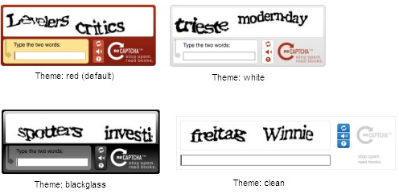
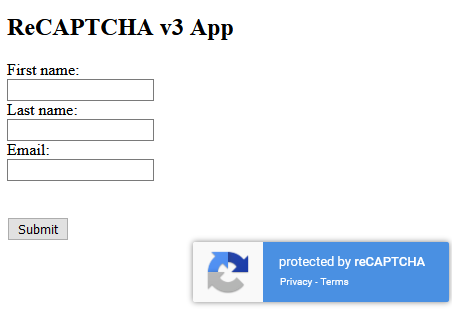

### Google Invisible Captcha - Part 1
---
# Captcha Introduction

#### What are bots?

Over the web, there is a lot of malicious software floating around, constantly trying to exploit web pages. We call these programs robots or bots. They are looking for ways to interact with sites in a way that will provide benefits to their creators.

What bots may want from your website? For example:

- They may pretend to be your customers and request to be contacted by your sales department. When they obtain your email address, they may try phishing attacks on your company.

- They may want to post fake reviews on your webpage, trying to advertise their own products.

#### What is captcha?

Captcha is a simple challenge presented on web pages to tell apart humans from bots. One of the most popular captcha providers is Google. Google brands its captcha algorithm as reCAPTCHA. Up to this day, there were three major versions of Google's reCAPTCHA (plus an enterprise one). You may remember older ones with some nostalgia:

- Version 1 presented a hard to read text (and a voice variant) to be retyped by the user:
  
  

- Version 2 tried to analyze visitor's behavior and included the "I'm not a robot" checkbox:

  

If the interaction was seen as potentially malicious, it resorted to presenting visitor a puzzle:

  

- Version 3 will **never** interrupt a visitor. The distinction will be made solely on the user's behavior during the visit. It scores users' interaction on a scale from 0 to 1 and lets you decide on your cut-off point (for example 0.6). It also lets you analyze past behaviors based on sub-page and type of interaction.
  
  

Everybody hated the earlier iterations of reCAPTCHA, and for a good reason. People agonized over few pixels in the corner being a part of the street sign or not -- only to get it wrong and be presented with a next challenge.

Now you can protect your page without annoying your customers, and this is probably a step in the right direction.

#### How to implement reCAPTCHA to protect your page?

In these articles, I will show you how you can register for reCAPTCHA v3 and implement it on your website. The examples will be presented in Apache Royale on the front and in Groovy/Grail on the back-end. These two technologies allowed our team to build this quickest and easiest but if you want you can easily translate this to your favorite technology stack.

- [Part 2 - Architecture and Registration](../architecture/)

- [Part 3 - Implementing Front-End in Apache Royale](../royale/)

- [Part 4 - Implementing Back-End in Groovy/Grails](../grails/)
