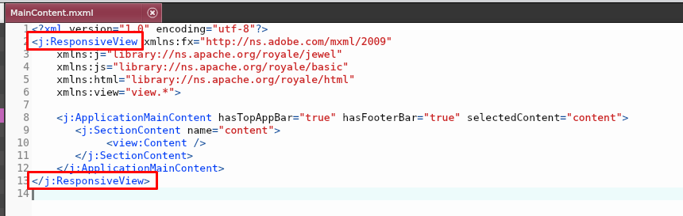

### Google Invisible Captcha - Part 3
---
# Implementing Front-End in Apache Royale

Moonshine IDE is one of the easiest ways to write Apache Royale code.

#### Installing Apache Royale

###### Step 1
First, you need to download Apache Royale.
Open up Moonshine IDE and go to:
`Help -> Getting Started`


###### Step 2
Click on `Download Third-party Software` 


###### Step 3
Find Apache Royale on the list. From the dropdown menu, choose `0.9.8 - Nightly` and click `Download`.


It is going to install Apache Royale to the Moonshine's default SDK folder, which is:
- `C:\MoonshineSDKs` on Windows
- ... on Mac

#### Creating Simple Jewels App
Jewels is a UI component set for Apache Royale. We're going to leverage this beautiful framework to create a simple yet elegant-looking form.

###### Step 4
Click on the `File -> New -> Royale Browser Project`.


###### Step 5
- Provide a name and a path for your project. 
- Select `Royale Browser Project Jewel` from the dropdown
- Make sure Royale you set 0.9.8 nightly as your SDK
- Click `Create`.


###### Step 6
Locate the `src/MainContent.mxml` file in the Project View on the left.


###### Step 7
Change `ApplicationResponsiveView` to `ResponsiveView` in both opening and closing tag:



###### Step 8
Click on `Project -> Build & Run`


###### Step 9
That should compile the project and start a built-in server. It can also open up a browser window with your project.

Somewhere in the console log, you should see green `Project Build Successfully.` In the bottom right corner, you should see a red indicator of a running server:


At any point in time, you can click the red indicator to stop the server.

#### Creating a From

###### Step 10
Go to `src/view/Content.mxml` file. Remove all the unnecessary tags inside VGroup and instead create a simple card section:

```
<j:Card percentWidth="100" >
        
    <j:CardHeader itemsHorizontalAlign="itemsCenter">
    </j:CardHeader>
    
    <j:CardPrimaryContent itemsHorizontalAlign="itemsCenter">
    </j:CardPrimaryContent>
    
    <j:CardActions itemsHorizontalAlign="itemsCenter">      
    </j:CardActions>
        
</j:Card>
```

The file should look like this:


###### Step 10
Click on `Project -> Build Project` and refresh the browser tab. The result should look like this:


###### Step 11
Before we move forward, we need to add the HTML namespace attribute to the VGroup tag:

```
xmlns:html="library://ns.apache.org/royale/html"
```


###### Step 12
Then, we can modify our CardHeader to take an HTML H1 content:

```
<j:CardHeader itemsHorizontalAlign="itemsCenter">
    <html:H1>ReCAPTCHA v3 App</html:H1>
</j:CardHeader>
```

###### Step 13
Next, we modify our CardPrimaryContent to take a Form with three FormItems -- one for the first name, one for the last name, and one for email.

```
<j:CardPrimaryContent itemsHorizontalAlign="itemsCenter">
    <j:Form id="signupForm" width="400">
        <j:FormItem label="First name:">
            <j:TextInput localId="firstName"/>
        </j:FormItem>
        <j:FormItem label="Last name:">
            <j:TextInput localId="lastName"/>
        </j:FormItem>
        <j:FormItem label="Email:">
            <j:TextInput localId="email"/>
        </j:FormItem>
    </j:Form>
</j:CardPrimaryContent>
```

###### Step 14
Finally, we add a Button to the CardActions.

```
<j:CardActions itemsHorizontalAlign="itemsCenter">
    <j:Button text="Create Account"/>
</j:CardActions>
```

###### Step 15
After building and refreshing, this is how the form should look like:


#### Interactivity

###### Step 16
To use JavaScript code, you need to create a pair of Script tags (from already included fx namespace). You should place those tags inside your root VGroup tag.

Then, you need to put the script itself inside the CDATA syntax.

```
<j:VGroup ...

    <fx:Script>
        <![CDATA[
        
            // JS logic goes here
            
        ]]>
    </fx:Script>

    <j:Card ...
```

###### Step 17
Let's show a simple alert when the button is clicked. Add the following method and imports inside CDATA:

```
import org.apache.royale.jewel.Alert;
import org.apache.royale.events.Event;

private function onSignupClick(event:Event) : void
{
    Alert.show("Message", "Title");
}
```

###### Step 18
And hook it up to click event inside Button tag:

```
<j:Button text="Create Account" click="onSignupClick(event)"/>
```

###### Step 19
Recompile, refresh the browser and try clicking on the button.


###### Step 20
Now, let's try to build some JSON out of the data in our form and displaying it in the alert.

```
private function onSignupClick(event:Event) : void
{
    var msg:String = JSON.stringify({               
        firstName: firstName.text,
        lastName: lastName.text,
        email: email.text                       
    });
    
    Alert.show(msg, "Title");
}
```


#### Sending the data

###### Step 21
We're going to add an HTTPService through Royale's mechanism caled [beads](https://apache.github.io/royale-docs/features/strands-and-beads){:target="_blank"}.

Let's add a beads section inside VGroup, and then an HTTP service pointing to our Grails back-end, which we're going to build in the next part.

```
<j:beads>
    <js:HTTPService id="service" 
        url="http://localhost:8080/user"
        contentType="application/json"
        complete="onComplete(event)"
        ioError="onIoError(event)" />
</j:beads>
```

The URL is a location of our back-end. For this tutorial, we will be building Grails back-end at this exact address.

###### Step 22
Using HTTPService requires adding js namespace:

```
xmlns:js="library://ns.apache.org/royale/basic"
```

###### Step 23
As you may notice, we used `complete` and `ioError` events on HTTPService. Let's implement their handlers.

```
private function onComplete(event:Event) : void
{
    Alert.show(service.data, "Complete");
}

private function onIoError(event:Event) : void
{
    Alert.show("Network failure.", "Error");
}
```

As you can see, the last response is stored in the `service.data` object, and you can access it in the `onComplete` handler.

###### Step 24
Now the final part -- sending. First, import HTTPConstants:

```
import org.apache.royale.net.HTTPConstants;
```

and then change showing the alert in `onSignupClick` to actually sending the message:

```
private function onSignupClick(event:Event) : void
{
    var msg:String = JSON.stringify({               
        firstName: firstName.text,
        lastName: lastName.text,
        email: email.text                       
        });

    service.contentData = msg;
    service.method = HTTPConstants.POST;                
    service.send();
}
```

#### Testing
We built a working view for our application. It is capable of sending our form data and receiving the response. No signs of reCAPTCHA yet, though. At this point, you may want to switch to [Implementing back-end in Grails](../grails/) to have some server to test against.

You CAN, in fact, run two server instances with Moonshine at the same time:
- Grails runs by default at http://localhost:8080/
- Royale runs by default at http://localhost:3000/

###### Step 25
The response we are receiving is not very readable in its current state. It may help you with testing if we made it a little prettier. Go to the `onComplete` callback. We're going to:
- Indent the JSON for better readability. Because the response is already in JSON format the easiest way to do this is to convert it to object and back to JSON with appropriate options.
- Wrap the message in `<pre>` tags to preserve the indentation in HTML.
- Increase the size of the Alert component

```
private function onComplete(event:Event) : void
{
    var msg:String = JSON.stringify(JSON.parse(service.data), null, 4);
    var htmlMsg:String = "<pre>" + msg + "</pre>";
    var alert:Alert = Alert.show(htmlMsg, "Complete");
    alert.width = 500;
    alert.height = 700;
}
```


#### Adding reCAPTCHA
With the rest of the communication in place adding reCAPTCHA is pretty easy. All we need to do is:
- add a tracker to our page
- when the button is clicked request an action token from google
- pass the token together with the data to the back-end

###### Step 26
Go to `src/resources/jewel-index-template.html`. 


Inside the head section add a line:

```
<script src="https://www.google.com/recaptcha/api.js?render=SITE_KEY"></script>
```

Substitute SITEK_KEY with the one you obtained during reCAPTCHA registration. This is a public key, so it will be visible to all the people browsing your page.


###### Step 27
Build the project and refresh your page. You should see the "protected by reCAPTCHA" logo.


###### Step 28
Go back to `Content.mxml`. Add a constant holding the site key:

```
private const SITE_KEY:String = "SITE_KEY";
```

###### Step 29
Create a new method named `sendRequest`. Make it accept a token of type string and return void. Now, cut everything from `onSignupClick` and paste it to the `sendRequest`. Adjust your JSON to contain both user and the token. This is how the final version of this method looks like:

```
private function sendRequest(token:String) : void
{
    var msg:String = JSON.stringify({               
        user:
        {
            firstName: firstName.text,
            lastName: lastName.text,
            email: email.text
        },
        token: token                                   
    });

    service.contentData = msg;
    service.method = HTTPConstants.POST;                
    service.send();
}
```

###### Step 30
Now go back to the `onSignupClick` method. We need it to:
- find google reCAPTCHA object embedded in your site by the script we included earlier
- make it invoke the `execute` method on that object, passing your site key, and optionally the name of the action your trying to protect
- receive the token as a response
- pass it to the `sendRequest` method.

It seems like a lot, but in reality, it's just almost a one-line implementation:

```
private function onSignupClick(event:Event) : void
{
    window["grecaptcha"]
        .execute(SITEK_KEY, {action: 'submit'})
        .then(sendRequest);
}
```

###### Step 31
This is how both methods should look like:


#### More Testing
If you have a working back-end in Grails, you can now test the two applications together. This is how a successful response looks like:


