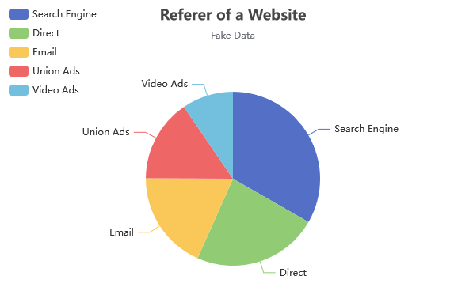

###### Feb 2nd, 2024
# Creating a Dynamic Pie Chart using Super.Human.Installer™ and Moonshine IDE™
---

We're excited to share with you a step-by-step guide on creating a dynamic pie chart using some incredible tools. Whether you're a seasoned developer or just starting out, this walkthrough promises to be both informative and enjoyable!

Data visualization plays a pivotal role in business settings, serving as an essential tool for decision-making, communication, and presentation. In an era where data is continuously growing in volume, complexity, and speed, the ability to effectively visualize data is not just a luxury but a necessity. Tools like Apache ECharts, an open-source JavaScript visualization library, offer a wide array of customizable chart options, including dynamic pie charts, which are excellent for representing part-to-whole relationships and making comparative analysis intuitive and impactful. For more information and to explore the library's features, visit the [Apache ECharts website](https://echarts.apache.org).

In this tutorial, we'll guide you through setting up a virtual machine that hosts a Domino database, which will store data detailing the number of website visits per referrer. To make this data accessible, we'll implement a REST API managed by Java Agents. On the frontend, we will deploy two Apache Royale projects. The first project is designed for efficiently editing the data, ensuring a user-friendly experience. The second project focuses on data representation, where we will create a dynamic pie chart to visually display the website visit statistics. This chart implements an example from ECharts website, as shown here:



## Getting Ready: Tools of the Trade

Before diving in, let's make sure we have all the necessary tools:

1. **VirtualBox:** This is a fantastic, free open-source hosted hypervisor for x86 virtualization. It's going to be the backbone of our setup.
2. **Vagrant:** A superb tool for building and managing virtual machine environments. It makes handling different development environments a breeze.
3. **Super.Human.Installer™:** The key to setting up your server environment efficiently. This makes things a lot easier!

## The First Steps: Setting Up Your Environment

Setting up your environment correctly is crucial. Here's how to do it:

1. **Installing the Essentials:**
   - First, grab and install [VirtualBox](https://www.virtualbox.org/wiki/Downloads), [Vagrant](https://developer.hashicorp.com/vagrant/downloads), and [Super.Human.Installer™](https://superhumaninstaller.com/). These tools are going to be the foundation of our project.

2. **Server Time:**
   - Next up, set up at least one server with Domino 12.0.1. 
   **Warning: You need to use this exact version, Domino 12.0.1 for the example to work**
   - You can find detailed instructions at [superhumaninstaller.com](https://superhumaninstaller.com#configuration-steps). Remember to note down your hostname and organization certifier.
   - When finished your configuration should look like this:
   
   
   
   In this example we're using `mars` as the hostname and `planests` as the certifier.
   - A pro tip: Don't forget to set up your etc/hosts!

## Crafting the Development Environment

With our server ready, let's set up the development environment:

1. **Moonshine IDE™ & SDK:**
   - Download and install [Moonshine IDE™](https://moonshine-ide.com/) and [Moonshine SDK Installer](https://moonshine-ide.com/download-sdk-installer/). These will be our tools for the actual development process.

2. **Preparing the Tools:**
   - Use the SDK Installer to download Git and the latest Apache Royale nightly version. These are essential for our project development.
   - Open `File -> Settings`, choose `Vagrant` tab and make sure that the server instance you created is visible in Moonshine IDE™.

   

   

## Building the Pie Chart Database Project

Now, the fun part begins – creating the Pie Chart!

1. **Project Setup:**
   - Open Moonshine IDE™ and go to `File -> New -> Domino on Disk Project`. Name your project `PieChartNsf` and click 'Create'.

2. **Configuration:**
   - Right-click on the project in the project list, go to `Settings -> Domino Tab -> Target Server`, and enter your hostname and organization certifier. In our case, it's `mars/planets`. Don't forget to save these settings!


3. **Designing the Database:**
   - Navigate to `src/main/formbuilder/PieChartNsf.dfb` in your project and open it. This is where we'll be adding the data for our pie chart.


4. **Adding Data:**
   - We'll input data in the form of country names and their corresponding percentage areas. ECharts pie chart expects data in 'name' and 'value' pairs, and that's exactly how we'll set up our columns.
   - Click the 'Add' button to create the name field. Use 
   ```
   Name: name
   Label: referer
   Type: Text
   ```


   - Add the value field. Use 
   ```
   Name: value
   Label: visits
   Type: number
   ```


5. **The Final Look:**
   - Once you've added your data, the table should look something like this (refer to the screenshots for a visual guide).


## Building and deploying database and agents
1. With the PieChartNsf project selected, go to `Project -> Build on Vagrant`. Choose the server you set up earlier.


2. With the project still selected, go to `Project -> Deploy Domino Database`
3. Now it's time to create Java Agents responsible for fetching and updating the data. Go to `Project -> Generate Java Agents`. When prompted, select the parent directory, so Java Agents are next to your NSF project.
4. Now select the Java Agents project, and go to `Project -> Run on Vagrant`. Wait for the agents to deploy.

## Creating Apache Royale CRUD project

In this stage of our tutorial, we are utilizing two Apache Royale projects to demonstrate a comprehensive data management and visualization workflow. The first is an auto-generated CRUD (Create, Read, Update, Delete) project, tasked with communicating with Java Agents for modifying the database. This includes creating, editing, and removing records. The second component is an Apache ECharts project, dedicated to presenting this data through an illustrative pie chart. For practicality, we have sourced a template project from GitHub to expedite this process. While it's entirely feasible to integrate these two projects into a single entity, for clarity and ease of understanding in this example, we will maintain them as separate projects.

1. With `PieChartNsf` project selected, go to `Project -> Generate Apache Royale Project`. Select the parent directory, so the `PieChartNsfRoyaleApplication` sits next to the Nsf and JavaAgents projects.
2. Right click newly creted project and go to `Settings`. Choose `Build Options`, `Custom SDK` and point to the latest Apache Royale nightly version (which you can download with Moonshine SDK Installer).
3. Go to `Project -> Build Project` to build on your local machine first.
4. With Apache Royale Application project selected, go to `Project -> Deploy on Vagrant Server`. Your URL should be populated automatically like this: `http://domino.mars.planets.com/PieChartNsfRoyaleApplication/js-debug/index.html` where 'mars' and 'planets' are your hostname and certifier. Click `Submit`.
5. The CRUD interface welcome page shuld open:


6. Use the web interface to populate the data like this:


## Using Apache Royale ECharts template

1. Download the example repository: https://github.com/Moonshine-IDE/PieChartExample
2. Extract the zip file and copy PieChartRoyale folder, so it sits next to PieChartNsf and PieChartNsf_JavaAgents folders.
3. In Moonshine IDE™, go to `Project -> Open/Import Project` and select PieChartRoyale.
4. Right click on the PieChartRoyale project. Go to `Settings -> Build Options -> Custom SDK` and select the latest Apache Royale nightly version.
5. Go to `Project -> Build Project` to build locally.
6. Then, go to `Project -> Deploy to Vagrant Server` and choose your created server.
7. Your URL should be populated automatically: https://domino.mars.planets.com/PieChartRoyale/js-debug/index.html with your hostname and certifier replaced.

This is the final result of the Pie Chart project:


And there you have it! By following these steps, you're well on your way to creating a dynamic and visually appealing pie chart. Stay tuned for more posts where we delve deeper into customizing and enhancing our chart.

Happy coding!